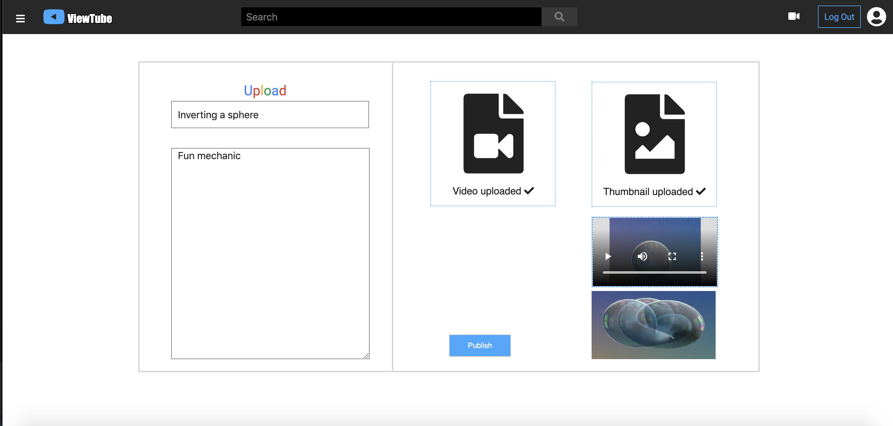
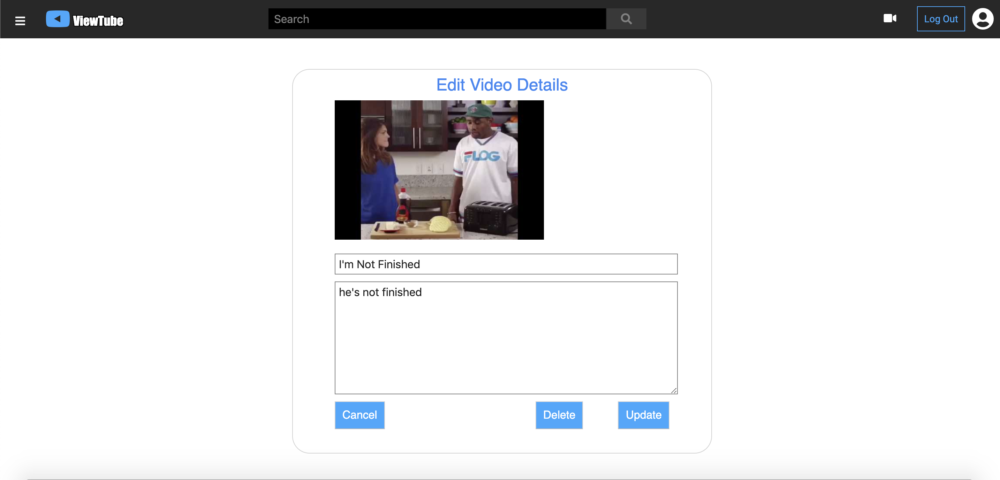

# ViewTube README

## Overview

ViewTube is a clone of the popular streaming site known as YouTube made with Ruby on Rails, PostgreSQL, React, Redux, CSS, Webpack, AWS, and Heroku. Users can watch videos, search for videos, and create accounts to upload and delete videos.


[Check Out the Live Site Here!](https://viewtube-fsp.herokuapp.com/#/)

ViewTube uses the MVC design pattern where the backend is implemented with Ruby on Rails, and the frontend is created with Redux and React. Videos and video thumbnails are stored on Amazon S3, and model information is stored on the Heroku Postgres database. Styling was done via normal CSS.

## Features
The app allows users to create accounts, and once logged in via their own account or the demo account, users are able to upload and delete videos. They are also able to comment on videos, and delete their own comments. Finally, logged in users are able to like and dislike any video. Whether logged in or not, users are still able to watch videos, search for videos, look at video indexes, and have access to the side modal.

### Video Upload
The database for video uploading is AWS which gets updated via a file reader in the upload form.



### Video Search

The search bar is a React form that passes the search query information to the search component which lists all videos where the search query is a substring of. The videos controller has a search function that searches through all the lowercased video titles that contain the lowercased query via active record.

### Video Comments

The comments component state has access to all comments, but when mapping states to props, only comments with a video id matching the current video id will be selected. The comments then need to be listed out, so the code goes through the state's comment array, and creates a comment item for each comment. However, since we want the most recent comment on the top, I changed the code to map through a shallow copy (so to not reverse the original comments array every time a render occurs) of the comments array in reverse order. 

### Video Likes/Dislikes
A logged in user can like or dislike each video. A like/dislike is created upon pressing either the like or dislike button, and the state of the like_dislike component keeps track of how many likes and dislikes there are for each video it is a child of. However, since users can only like or dislike once, if a user likes a video that they dislike, for example, the code destroys the dislike, creates a like, and manipulates the state's likes and dislikes appropriately.

## Video Editing
A logged in user can edit his or her own video's details including the title and description. Furthermore, in the edit page, the user can delete his or her video.



## Code Snippets

Employed Active Record comparison methods in Video's controller to render relevant videos for search class component resulting in expeditious table lookups

```
def search
  input = params[:query].downcase
  @videos = Video.where("LOWER(videos.title) LIKE ?", "%#{input}%")

  # debugger
  render :index
end
```

File inputs need to be read so that the form data can be processed appropriately when creating videos.

```
updateVideo(e) {
  const file = e.currentTarget.files[0];
  const reader = new FileReader();
  reader.onloadend = () => {
    this.setState({ video: reader.result, videoFile: file });
  }
  if (file) {
    reader.readAsDataURL(file);
  }
}
```

Blob table created for AWS S3 video and image uploading.

```
def change
    create_table :active_storage_blobs do |t|
      t.string   :key,        null: false
      t.string   :filename,   null: false
      t.string   :content_type
      t.text     :metadata
      t.bigint   :byte_size,  null: false
      t.string   :checksum,   null: false
      t.datetime :created_at, null: false

      t.index [ :key ], unique: true
    end

    create_table :active_storage_attachments do |t|
      t.string     :name,     null: false
      t.references :record,   null: false, polymorphic: true, index: false
      t.references :blob,     null: false

      t.datetime :created_at, null: false

      t.index [ :record_type, :record_id, :name, :blob_id ], name: "index_active_storage_attachments_uniqueness", unique: true
      t.foreign_key :active_storage_blobs, column: :blob_id
    end
  end
```
## Potential Future Features

* Video Views
* Channels
* Subscriptions
